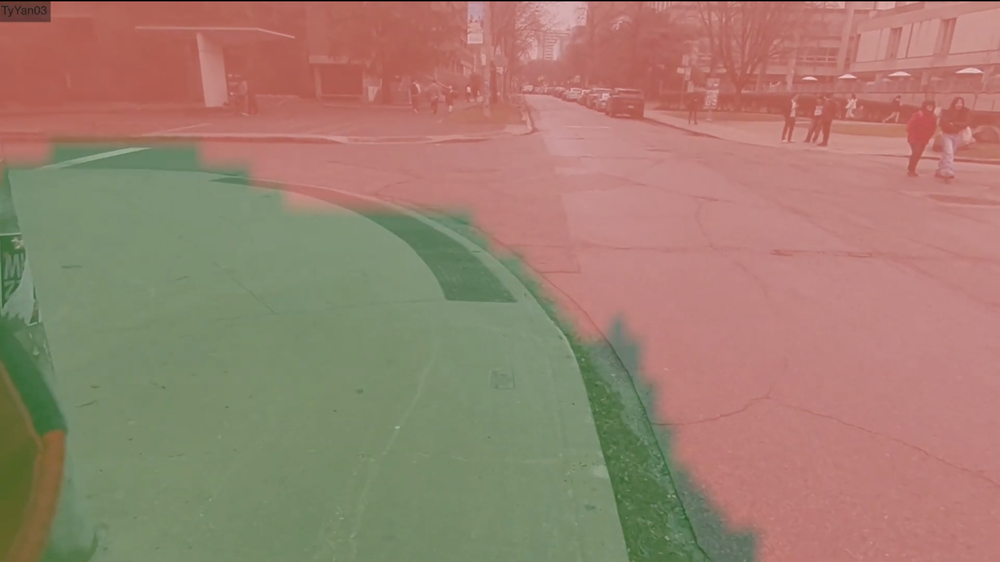
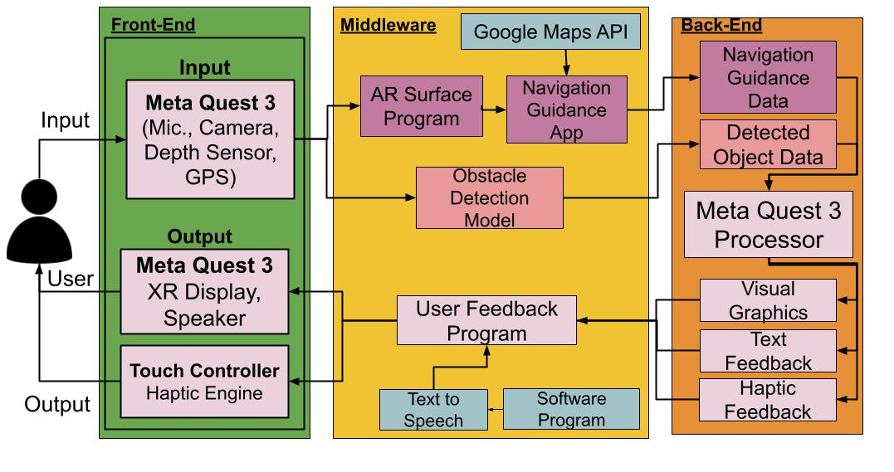
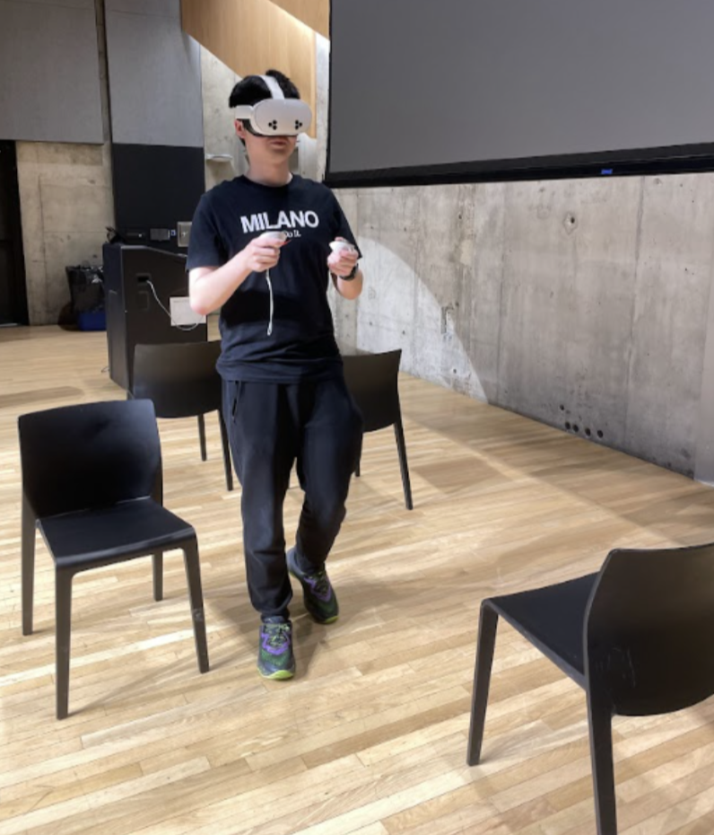
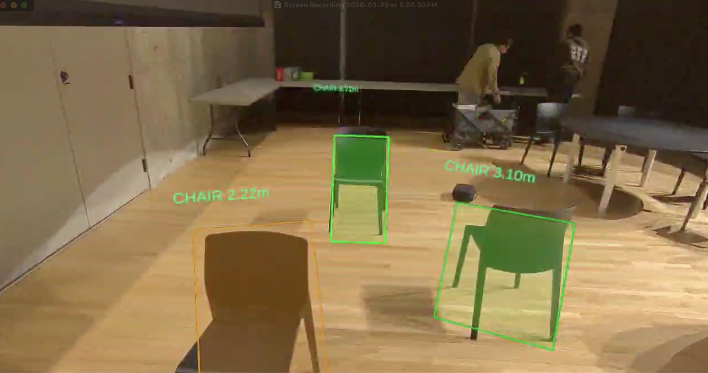

# XR Wearable Navigation Assistance System for Visually Impaired Users  

> 🏆 **Top Research Project Award (Certificate of Recognition)**  
---
## Overview
The **XR Seeing Aid** is a real-time assistive navigation system that enables visually impaired users to navigate safely and independently using **extended reality (XR)**.

Built on the **Meta Quest 3**, the system integrates:
- Real-time **obstacle detection**
- **Surface segmentation** for safe path identification
- **Voice-controlled navigation**
- **Multimodal feedback** (visual, audio, haptic)

All computation is performed **fully on-device**, achieving **sub-200 ms latency** without requiring cloud processing or external hardware.

Traditional mobility aids such as canes and guide dogs can be difficult to use in certain environments, while many existing technological solutions offer limited functionality and are financially inaccessible. This system is intended to complement existing aids.

Unlike conventional augmented reality solutions, XR expands user perception by blending virtual, augmented, and mixed realities. This approach enables the system to provide enhanced visual, auditory, and tactile awareness of the surrounding environment—information that may otherwise be inaccessible to visually impaired users.

## 🎥 Demo Video

Click the images below to watch live demonstrations of the XR-based navigation system:
| Obstacle Detection | Surface Segmentation |
|:-------------:|:--------------------:|
|  |  |

## Highlights
- **Real-time ML on consumer XR hardware** (no cloud dependency) 
- **91.7% collision avoidance rate** in testing 
- **≤200 ms end-to-end latency** across all feedback modes 
- **100% navigation instruction accuracy**
- Fully **self-contained wearable system** 

## Key Features
- **Real-Time Obstacle Detection**  
  - Custom machine learning models detect and track obstacles within the user’s field of view, enabling rapid and reliable environmental awareness
  - 80 Object Classes
  - Detection Range: 0.1m - 12.5m

- **Real-Time Safe Path Segmentation**
  - Custom machine learning models detect and display safe and unsafe walking areas within the user's field of view
  - 10 Surface Types  
  - Safe vs Unsafe Terrain Classification  

- **Hands-Free Navigation**
  - Built-in navigation support provides directional guidance and route awareness directly within the XR interface
  - Voice input → Destination Parsing → Real-time routing using GPS + Google Maps API  
  - Turn-by-turn instructions with **automatic rerouting**  

- **Multimodal Feedback System**  
  The device delivers feedback through a combination of:
  - **Visual:** Bounding boxes + safe path overlays  
  - **Audio:** Real-time spoken alerts + navigation instructions  
  - **Haptic:** Directional vibration encoding distance & position

  Note: These modalities can be used independently or together to accommodate varying levels of visual impairment.

## System Architecture

## Testing Results

| **Metric**                          | **Result**           |
|------------------------------------|--------------------|
| **Obstacle Detection Accuracy**     | 91% (≤12.5m range)    |
| **Surface Segmentation Accuracy**   | 86%                 |
| **Collision Avoidance Rate**        | 91.7%               |
| **Navigation Accuracy**             | 100%                |
| **End-to-End Latency**              | ≤ 200 ms            |

*Metrics validated with real-world testing in indoor and outdoor environments.*

## Validation
We validated the system through extensive real-world testing, including indoor and outdoor environments, with both static and dynamic obstacles.

Here’s a visual overview of the system in testing:
|  |  |
|:-------------:|:--------------------:|
|  |  |
| *Testing environment setup with user.* | *Point-of-view image from the headset showing real-time overlays and guidance.* |

**Results:** Users successfully navigated environments independently using the system, demonstrating the effectiveness of real-time multimodal feedback.   

## Hardware Platform
The system is implemented on the **Meta Quest 3 headset**, selected for its compact design, integrated sensors, and proven reliability as a consumer XR device. Embedding the solution directly into this headset removes the need for external peripherals, resulting in a streamlined and wearable eyewear-based system.

## Applications and Impact
Although primarily designed for visually impaired users, the system has broader applications in complex environments such as construction sites, crowded urban areas, and low-visibility conditions. By enhancing situational awareness and navigation confidence, the project demonstrates how XR technologies can serve as an everyday assistive tool for a wide range of users.

## Goal
The ultimate goal is to create an **accessible, affordable, and effective XR navigation solution** that enhances user safety, autonomy, and confidence while extending the benefits of XR technology to a broader population.

| Obstacle Detection | Surface Segmentation | GPS Navigation (Visual Feedback - WIP) |
|:-------------:|:--------------------:|:--------------------:|
|  |  |  | 
> [!NOTE]
> You must use a physical headset to preview the passthrough camera. XR Simulator and Meta Horizon Link do not currently support passthrough cameras.

## Next Steps
- Testing with more visually impaired users   
- Custom lightweight hardware (smart glasses form factor)  
- Personalization of feedback system
- Robustness in low-visibility conditions
